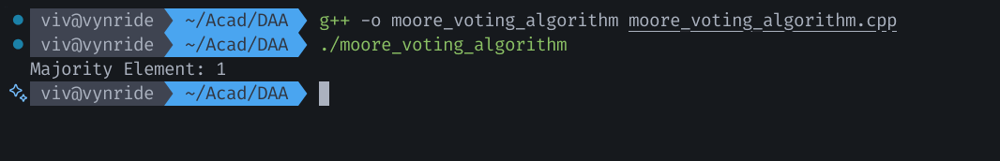

### Name: Vivian Richard Demello
### Section: A1
### Roll No: 2


## Q.2: Program to find majority element from an array using Moore Voting Algorithm  

Moore Voting Algorithm is used to find the majority element in an array.

Majority element is the one that appears more than N/2 times in the array.  

### Complexity:
Time Complexity: O(N)  
Only 2 traversal over array are needed  
  
Space Complexity: O(1)  

### Algorithm: 

Algorithm: Moore's Voting Algorithm (Candidate, Count = 0):

1. Select first element as Candidate element
2. Iterate over the array:
	2.1. If current element is candidate element increment Count 			 by 1
	2.2. If current element is not candidate element then 					 decrement Count by 1
	2.3. If Count is 0 at any point then set current element as 		         Candidate
3. Now we iterate over the array 2nd time and count the number of   the Candidate element occurs
	3.1 If it occurs more than N/2 times then it is the majority
	element
	3.2 If it does not occur more than N/2 times then majority
	element does not exist
	

Example: 2 1 1 1 1 1 3 1 1 2

Here then majority element is 1

1. Set Candidate to first element i.e. Candidate = 2
2. Iterate over array and increment count by 1
3. As 2nd element is 1 the count is decremented by 1
4. As we get 0 here, the Candidate element is now set to 1 and count = 1
5. Then at 7th element we have 3 so count is decremented by 1 (count = 5 - 1 = 4)
6. Then we increment count by 2 for 8th and 9th element then count is decremented by 1 for 10th element
7. So finally count = 5
8. Now we iterate over array again and check count of Candidate=1 in the array, as it is 7.
9. We can conclude that it is correct and 1 is majority element.


#### C++ Code

```cpp
#include<iostream>
#include<vector>
using namespace std;

int findMajorityElement(vector<int>& nums) {
    int count = 0;
    int candidate = nums[0];

    for (int num : nums) {
        if (count == 0) {
            candidate = num;
            count = 1;
        } else if (num == candidate) {
            count++;
        } else {
            count--;
        }
    }

    count = 0;
    for (int num : nums) {
        if (num == candidate) {
            count++;
        }
    }

    if (count > nums.size() / 2) {
        return candidate;
    } 
    
    else {
        return -1;
    }
} 
 
int main() {
    vector<int> nums = {2, 1, 1, 1, 1, 1, 3, 1, 1, 2};

    int majority = findMajorityElement(nums);

    if (majority != -1)
        cout << "Majority Element: " << majority << endl;
    else
        cout << "No Majority Element found." << endl;
} 
```


Output:

