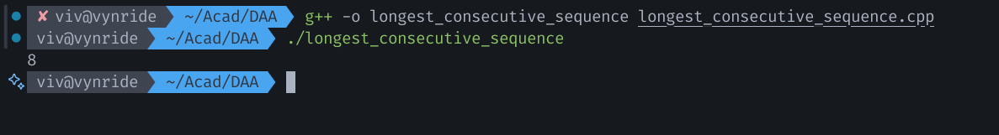

### Name: Vivian Richard Demello
### Section: A1
### Roll No: 2


## Q.4: Program to detect a longest consecutive sequence in an array  

Consecutive sequence means a sequence in which elements are consecutive numbers

### Complexity:
Time Complexity: O(N)   
Looping through array once needs O(N) time
Space Complexity: O(1)  
Extra space for storing longest and current length is needed  

### Algorithm:

Algorithm: Program to detect the longest consecutive sequence in an array:

1. Create a set of the numbers
2. Initialize longest sequence length to 0
3. Loop through each num in the set
	3.1. If num - 1 is not in the set, then it can be start of a sequence
	3.2. Count the length of this sequence by checking for num + 	    1, num + 2, and so on in set
	3.3. Update longest with the length of this sequence if it's		    the new maximum
4. Return longest

Example: 1 8 2 3 4 6 7 5 11 15 23
Output: 8

### C++ Code:

```cpp
#include <iostream>
#include <vector>
#include <unordered_set>
#include <algorithm>

using namespace std;

int findLongestConsecutive(vector<int>& nums) {

    unordered_set<int> numSet(nums.begin(), nums.end());
    int longest = 0;

    for (int num : numSet) {
        if (numSet.count(num - 1) == 0) {
            int currentNum = num;
            int currentStreak = 0;
            
            while (numSet.count(currentNum)) {
                currentNum++;
                currentStreak++;
            }
            longest = max(longest, currentStreak);
        }
    }
    return longest;
}

int main() {
    vector<int> nums = {1, 8, 2, 3, 4, 6, 7, 5, 11, 15, 23}; 
    
    cout << findLongestConsecutive(nums) << endl; 
}  
```

Output:

