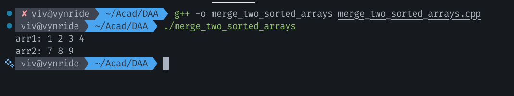

### Name: Vivian Richard Demello
### Section: A1
### Roll No: 2

## Q.9: Program to Merge two sorted arrays without extra space

We are given two sorted arrays and we have to merge them into a single sorted array without using any extra space

### Complexity:
**Time Complexity: O(m * n)**  
In the worst case, for each of the `m` elements in the first array, we will have to shift up to `n` elements in the second array

**Space Complexity: O(1)**  
Only constant space for pointers is needed

### Algorithm:

Algorithm: Merge two sorted arrays (arr1, arr2):

1.  We'll walk iterate through the first array and compare its elements with the first element of the second array
2.  We start with a pointer `i` at the beginning of `arr1` and a pointer `j` at the beginning of `arr2`.
3.  If the element `arr1[i]` is smaller than `arr2[j]`, it's already in the correct place, so we just move to the next element in `arr1`
4. If `arr1[i]` is larger than `arr2[j]`, we know `arr2[j]` belongs in the first array so, we swap them
5.  After the swap, the new element we just put into `arr2` might not be in the right place. We must fix `arr2` by shifting this new element to its correct sorted position
6.  We will do this process until we have checked every element in `arr1`

**Example:** `arr1 = {1, 4, 7, 8}`, `arr2 = {2, 3, 9}`

**Output:** `arr1 = {1, 2, 3, 4}`, `arr2 = {7, 8, 9}`

### C++ Code:

```cpp
#include <iostream>
#include <vector>
#include <algorithm>

using namespace std;

void merge(vector<int>& arr1, vector<int>& arr2) {
    int m = arr1.size();
    int n = arr2.size();

    for (int i = 0; i < m; i++) {
        if (arr1[i] > arr2[0]) {
            swap(arr1[i], arr2[0]);

            int first = arr2[0];
            int k;
            for (k = 1; k < n && arr2[k] < first; k++) {
                arr2[k - 1] = arr2[k];
            }
            arr2[k - 1] = first;
        }
    }
}

void printArray(const vector<int>& arr) {
    for (int num : arr) {
        cout << num << " ";
    }
    cout << endl;
}

int main() {
    vector<int> arr1 = {1, 4, 7, 8};
    vector<int> arr2 = {2, 3, 9};
    
    merge(arr1, arr2);
    
    cout << "arr1: ";
    printArray(arr1);
    cout << "arr2: ";
    printArray(arr2);
}
```

Output:

